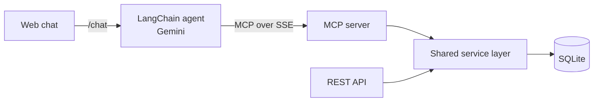

# MCP Library Agent

A library management system exposed to an AI agent through the **Model Context Protocol (MCP)**. A REST API manages books and authors, an MCP server wraps the same business layer as tools, resources and a prompt, and a LangChain agent powered by Google Gemini uses those tools to answer natural-language requests from a simple web chat.

University project for the *Integração de Sistemas* (Systems Integration) course, Computer Engineering (LEI), University of Coimbra.

<!-- TODO: add a GIF or screenshot of a chat where the agent uses the tools (e.g. "add a book by an existing author") -->

## What is MCP?

The [Model Context Protocol](https://modelcontextprotocol.io) is an open standard that lets LLM applications connect to external tools and data sources in a uniform way. Here, the MCP server publishes the library operations, and the agent discovers and calls them on its own.

## Features

- REST API with CRUD for books and authors (FastAPI + SQLModel + SQLite)
- MCP server (FastMCP, SSE transport) with tools, resources and a prompt, sharing the same service layer as the REST API
- LangChain / LangGraph agent with conversation memory and a `/reset` endpoint
- Web chat (`webapp.html`)

## Architecture



### MCP server

| Kind | Name | Description |
|---|---|---|
| Tools | `list_books_tool`, `get_book_tool`, `create_book_tool`, `update_book_tool`, `delete_book_tool` | Manage books |
| Tools | `list_authors_tool`, `get_author_tool`, `create_author_tool`, `create_author_from_text_tool`, `update_author_tool`, `delete_author_tool` | Manage authors |
| Resources | `library://catalog-summary`, `library://authors-summary` | Summaries of the catalog and of the authors, used as context |
| Prompt | `library_assistant_prompt` | System instructions for the assistant |

### Services and ports

| Service | File | Address |
|---|---|---|
| REST API | `main.py` | http://127.0.0.1:8001 |
| MCP server | `mcp_server.py` | http://127.0.0.1:8002/sse |
| Agent API | `langchain_agent.py` | http://127.0.0.1:8000 (`/chat`, `/reset`, `/health`) |

## Tech Stack

Python · FastAPI · SQLModel · SQLite · FastMCP · LangChain · LangGraph · Google Gemini

## Project Structure

```
src/
├── ProjetoBase_MCP_Agent_Web/
│   ├── app/                  # shared layer: db.py, models.py, services.py
│   ├── main.py               # REST API
│   ├── mcp_server.py         # MCP server
│   ├── langchain_agent.py    # agent API
│   ├── webapp.html           # chat interface
│   └── requirements.txt
└── start_all.bat             # starts the three services on Windows
```

## Getting Started

### Prerequisites

- Python 3.10+
- A Google AI (Gemini) API key

### Installation

```bash
cd src/ProjetoBase_MCP_Agent_Web
python -m venv .venv
source .venv/bin/activate        # on Windows: .venv\Scripts\activate
pip install -r requirements.txt
cp .env.example .env             # then put your own GOOGLE_API_KEY in .env
```

### Usage

Each command in its own terminal:

```bash
python main.py             # REST API
python mcp_server.py       # MCP server
python langchain_agent.py  # agent API
```

Then open `webapp.html` in the browser. The SQLite database (`library.db`) is created on first run.

## Authors

Simão Carvalho, André Rodrigues · University of Coimbra · Computer Engineering · 2026
